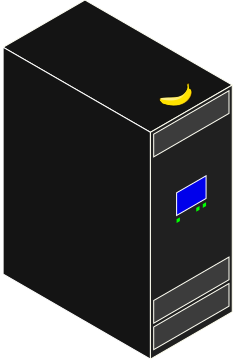
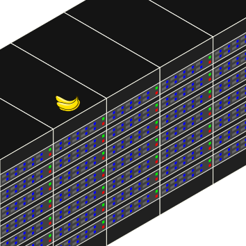

# Your Personal Computer

{height=45%}

- Familiar starting point, accessed locally
- Good for local computational tasks
- Highly flexible, easy to reconfigure for new tasks

# Shared Computing Resources

)](img/High_Performance_Computing_Center_Stuttgart_HLRS_2015_07_Cray_XC40_Hazel_Hen_IO.jpg){height=40%}

<!-- Image: https://commons.wikimedia.org/wiki/File:High_Performance_Computing_Center_Stuttgart_HLRS_2015_07_Cray_XC40_Hazel_Hen_IO.jpg, Julian Herzog. -->

- Large-scale computation is different
- It has a rich history, and confusing terminology
- Many terms overloaded

# A large computer

{height=45%}

- More powerful "compute server"
- Accessed remotely, likely shared by a small group
- Less flexible -- need to accommodate other users

# A mainframe

{height=45%}

- Very powerful special-purpose system
- Generally non-interactive
- Managed at a large-organization level

# A cluster or supercomputer

{height=45%}

- Special "login node" or "head node" accessed remotely by users
- Compute service accessed via resource manager
- Some flexibility on local accounts
- Specially-built software for best performance

# A larger cluster

{height=50%}

- May be more heterogeneous
- "The Cloud" looks like this, many types of servers
